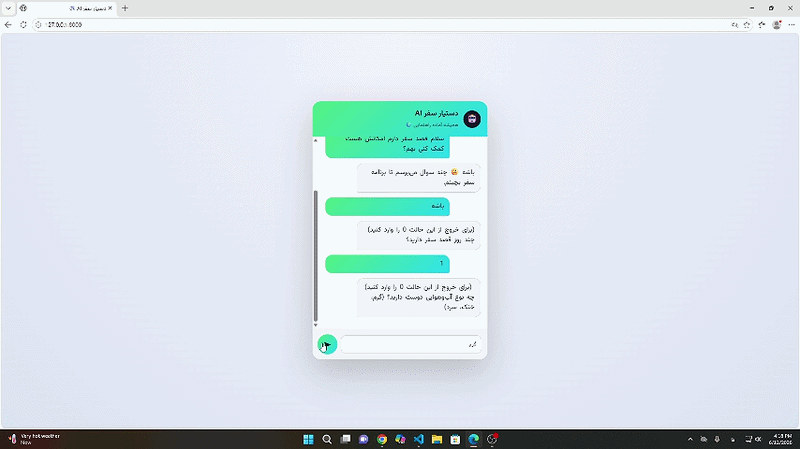

# 🧳 AI Travel Assistant

AI Travel Assistant is a conversational system that helps users explore travel destinations, get city information, check weather conditions, and generate personalized travel plans.


Unlike a traditional chatbot, this project combines multiple AI components to provide more structured and context-aware responses:

- Intent Classification to understand user requests
- Stateful Conversation Management to maintain context during multi-turn chats
- Retrieval-Augmented Generation (RAG) for city-related information
- Vector Search for semantic retrieval
- Multi-model LLM fallback for reliability
- Personalized travel recommendation based on user preferences

The System can :
- Suggest suitable cities for travel
- Generate personalized travel itineraries
- Answer questions about cities and weather conditions   
- Compare different destinations

This project was built as a hands-on learning experience to improve my skills in AI system design, especially in areas such as RAG pipelines, conversation management, and building real-world LLM-based applications.

---
# 🎬 Demo




# 🚀 Features

## Travel Recommendation Engine

* Generate a basic user profile based on the conversation and user preferences
* Recommend destinations based on user interests
* Recommand the plan for the city by cheking the users interers and recommand the place of city same to users interser
* Create travel plans using a combination of content-based filtering and cosine similarity to match cities with user profile


## Intelligent Conversation System

* Multi-turn dialogue support with context awareness
* Conversation state management to track user progress during interaction
* History-aware responses to maintain continuity across different stages of conversation

## City Information Retrieval (RAG)

* Retrieve city information from a local data source for answering user queries
* Provide context-aware responses using stored city data and conversation history
* Compare cities based on structured information from the dataset

## Weather Assistant

* Fetch real-time weather data using external APIs
* Fallback to a local offline dataset when the API is unavailable or fails

## City Comparison

* Compare multiple destinations
* Travel decision assistance


---

# 🏗️ System Architecture

```text
User Message
      │
      ▼
Intent Classifier
      │
      ▼
Conversation State Manager
      │
      ▼
Router
 ┌────┼────┬─────┬─────┐
 ▼    ▼    ▼     ▼     ▼
Weather City Plan Compare NormalChat
   │     │    │      │      │
   │     │    │      │      └──────────┐
   │     │    │      │                 │
   └─────┴────┴──────┘                 │
            │                          │
            ▼                          ▼
      RAG / APIs              LLM Response Generator
            │                          ▲
            └──────────────────────────┘
```

---

# 📂 Project Structure

```text
AI_Travel_Agent/
├── app/
│   ├── main.py
│   │
│   ├── md_to_embeddings.py
|   | 
│   ├── llm/
│   │   ├── client.py
│   │   ├── model_manager.py
│   │   ├── travel_plan.py
│   │   └── log.py
│   │
│   ├── rag/
│   │   ├── retrieval.py
│   │   ├── vector_search.py
│   │   └── embeddings.py
│   │   
│   │
│   ├── router/
│   │   ├── intent.py
│   │   └── weather_intent.py
│   │   
│   │   
│   │
│   ├── state/
│   │   ├── handel_user.py
│   │   ├── memory.py
│   │   ├── save_answer.py
│   │   ├── state_user.py
│   │   ├── travel_question_step.py
│   │   └── validation.py
│   │
│   ├── CBF_Recommendation/
│   │   ├── city_matrix.py
│   │   ├── model_weight.py
│   │   └── recommandation_score.py
│   
│
├── data/
├── requirements.txt
└── README.md
```

## Important Files

### main.py

Application entry point and FastAPI server.

### intent.py

Intent classification and entity extraction.


### weather_intent.py

Weather retrieval and weather-response generation.

### data/

Local city knowledge base used by the RAG system.


---

# 🧠 Tech Stack

* Python
* FastAPI
* OpenRouter API
* litellm
* RAG
* Vector Database(faiss)
* Embeddings
* Docker

---

# ⚙️ Installation

```bash
git clone https://github.com/AryaRabiee/AI_Travel_Agent.git

cd AI_Travel_Agent

python -m venv venv

# Linux / Mac
source venv/bin/activate

# Windows
venv\Scripts\activate

pip install -r requirements.txt
```

Create `.env`

```env
OPENROUTER_API_KEY=your_api_key
WEATHER_API_KEY=your_api_key
```

Run:

```bash
fastapi dev main.py
```

---

# 🐳 Docker

Build image:

```bash
docker build -t travel-assistant .
```

Run container:

```bash
docker run -p 8000:8000 --env-file .env travel-assistant
```

---

# ⚠️ Current Limitations

* Supports a limited number of cities(6 cities)
* No flight booking integration
* No hotel booking integration
* Intent classification is currently based on prompting and may occasionally misclassify ambiguous user requests.
* No long-term memory

---

# 🧪 Future Improvements

* Improve intent classification accuracy and ambiguity handling
* Add city-to-city distance calculation
* Recommend transportation methods (car, train, flight)
* Retrieve attraction addresses and location information
* Integrate weather-aware travel recommendations
* Expand city knowledge base and tourism data
* Evaluation framework for RAG quality assessment
* Advanced memory management
* Response caching layer
* Production monitoring and observability


---

# ⭐ Project Status

Current Version: **v1.0.0**

This version represents the first stable release of the AI Travel Assistant.
